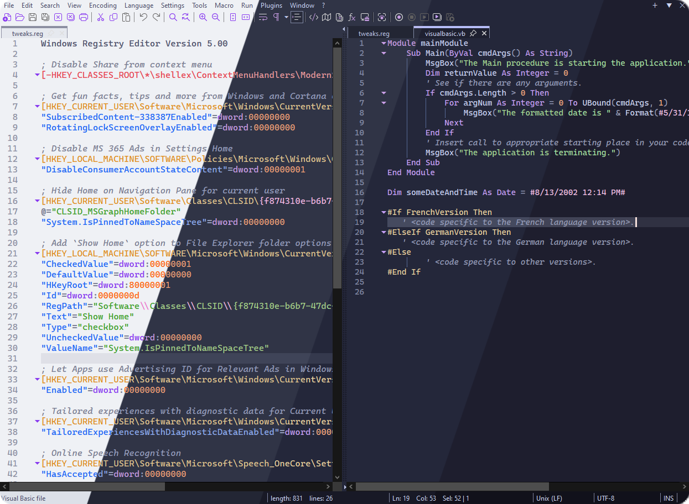
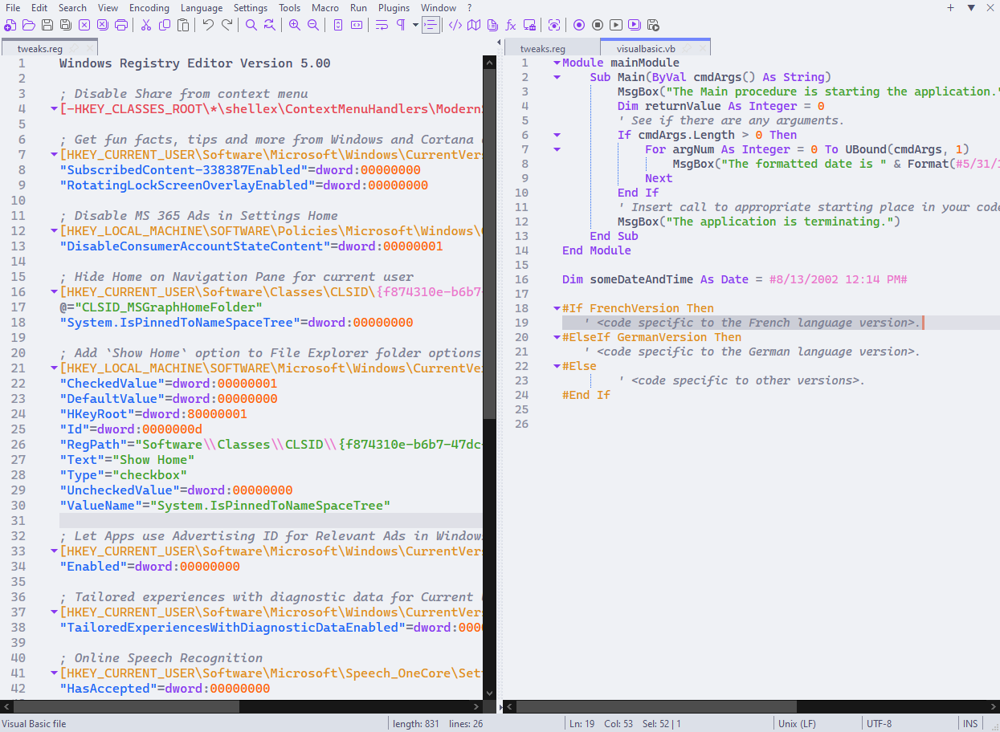
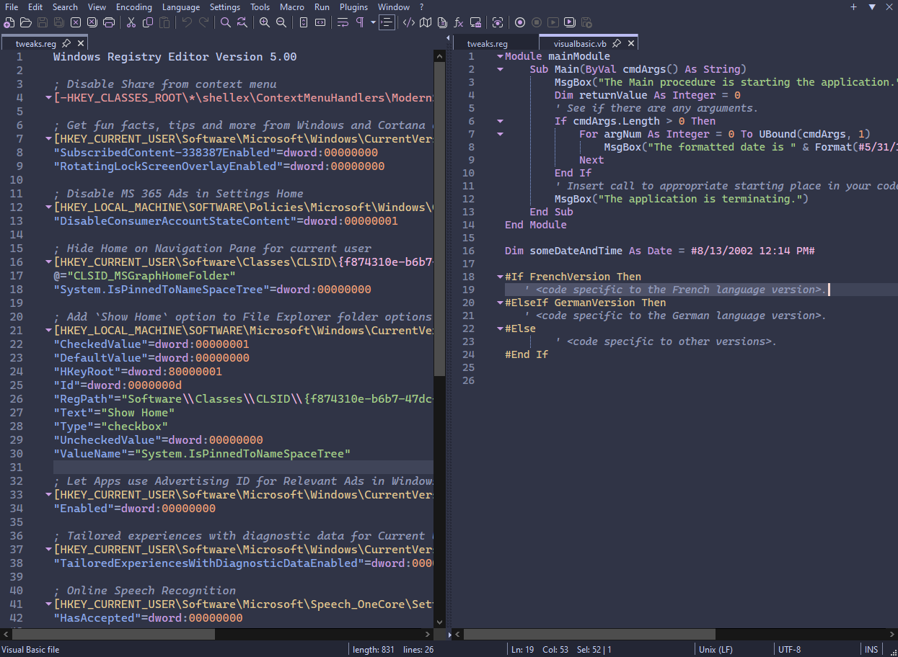
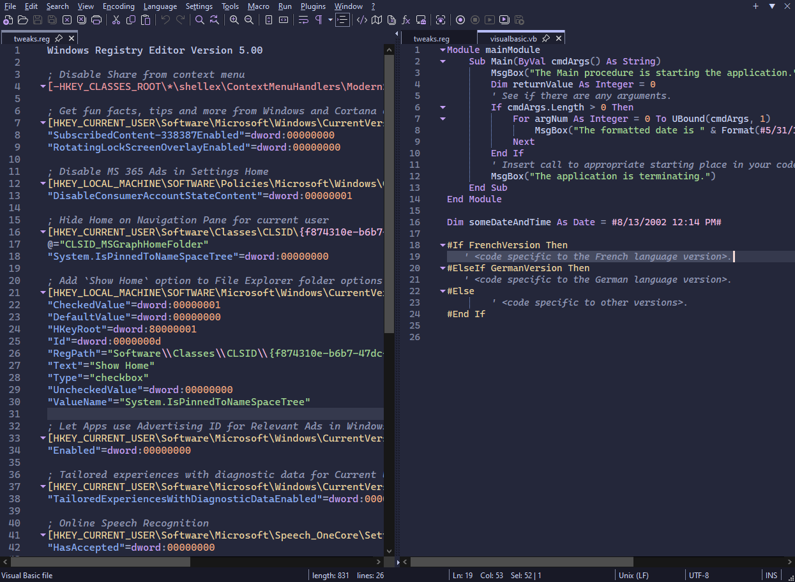
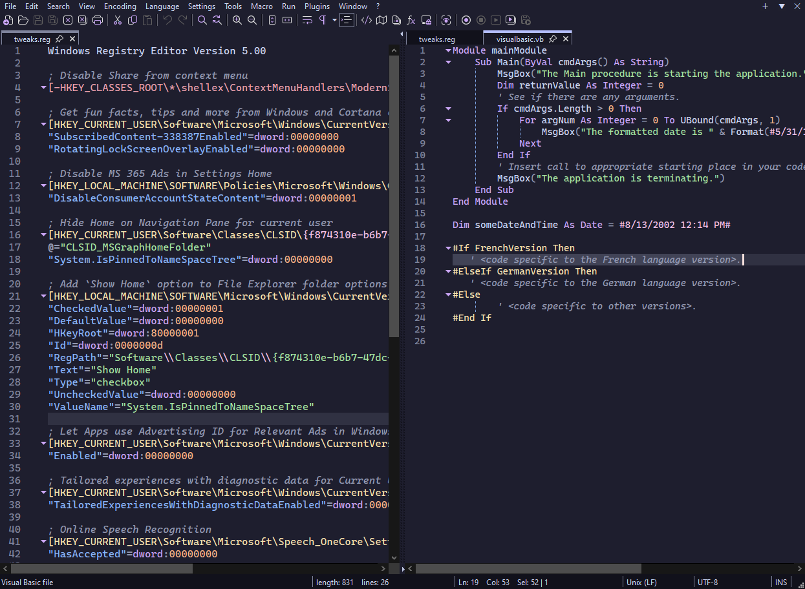

<h3 align="center">
   
  
  Catppuccin for <a href="https://github.com/notepad-plus-plus/notepad-plus-plus">Notepad++</a>
  
</h3>

  
  
  

  

## Previews

🌻 Latte

🪴 Frappé

🌺 Macchiato

🌿 Mocha

## Usage

1. Download your preferred flavor(s) from [`themes/`](./themes/).
2. Move downloaded flavor(s) to `%AppData%\Notepad++\themes`.
3. Select the desired theme in Settings > Style Configurator
4. To customize the UI colors (non-editor area), follow the instructions for your flavor on this page: [`ui-theme.md`](./ui-theme.md)

## 💝 Thanks to

- [Dracula Notepad++](https://github.com/dracula/notepad-plus-plus)
- [InvitedToHell](https://github.com/InvitedToHell)
- [Dukk](https://github.com/DakshG07)
- [winston](https://github.com/nekowinston)

&nbsp;

  

  Copyright &copy; 2023-present <a href="https://github.com/catppuccin" target="_blank">Catppuccin Org</a>

  

